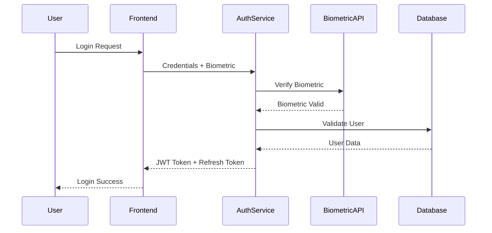

# Architecture Guide

## System Overview

The ChitraHarsha VPK Yantra platform is built on a modern, scalable architecture designed to handle enterprise-scale workloads while maintaining high performance, security, and reliability.

## High-Level Architecture

```
┌─────────────────────────────────────────────────────────────────┐
│                        Global Edge Network                       │
│                         (330+ Nodes)                           │
└─────────────────────┬───────────────────────────────────────────┘
                      │
┌─────────────────────▼───────────────────────────────────────────┐
│                    Load Balancer                               │
│                 (Geographic Routing)                           │
└─────────────────────┬───────────────────────────────────────────┘
                      │
        ┌─────────────┼─────────────┐
        │             │             │
        ▼             ▼             ▼
┌─────────────┐ ┌─────────────┐ ┌─────────────┐
│   Region    │ │   Region    │ │   Region    │
│   US-East   │ │   EU-West   │ │ Asia-South  │
└─────────────┘ └─────────────┘ └─────────────┘
        │             │             │
        └─────────────┼─────────────┘
                      │
┌─────────────────────▼───────────────────────────────────────────┐
│                  Core Services Layer                           │
├─────────────────────────────────────────────────────────────────┤
│  Frontend    │  API Gateway  │  Auth Service │  AI Engine      │
│  (React)     │  (GraphQL)    │  (Firebase)   │  (TensorFlow)   │
├─────────────────────────────────────────────────────────────────┤
│  Innovation  │  Analytics    │  Cloud Mgmt   │  Intelligence   │
│  Search      │  Engine       │  Service      │  Hub            │
└─────────────────────┬───────────────────────────────────────────┘
                      │
┌─────────────────────▼───────────────────────────────────────────┐
│                   Data Layer                                   │
├─────────────────────────────────────────────────────────────────┤
│  10T SQL     │  Document DB  │  Cache Layer  │  File Storage   │
│  Engine      │  (MongoDB)    │  (Redis)      │  (S3/GCS)       │
└─────────────────────────────────────────────────────────────────┘
```

## Frontend Architecture

### Component Structure
```
src/
├── components/
│   ├── common/
│   │   ├── Header.jsx
│   │   ├── Footer.jsx
│   │   ├── Navigation.jsx
│   │   └── Icons.jsx
│   ├── auth/
│   │   ├── LoginForm.jsx
│   │   ├── RegisterForm.jsx
│   │   └── BiometricAuth.jsx
│   ├── dashboard/
│   │   ├── CloudDashboard.jsx
│   │   ├── ResourceMonitor.jsx
│   │   └── Analytics.jsx
│   ├── innovation/
│   │   ├── SearchEngine.jsx
│   │   ├── PatentAnalysis.jsx
│   │   └── NoveltyScore.jsx
│   └── intelligence/
│       ├── ArticleList.jsx
│       ├── ArticleDetail.jsx
│       └── SEOMetrics.jsx
├── hooks/
│   ├── useAuth.js
│   ├── useFirebase.js
│   └── useAnalytics.js
├── services/
│   ├── api.js
│   ├── firebase.js
│   └── analytics.js
├── utils/
│   ├── constants.js
│   ├── helpers.js
│   └── validators.js
└── styles/
    ├── globals.css
    ├── components.css
    └── animations.css
```

### State Management
```javascript
// Global state management using React Context
const AppContext = createContext();

const AppProvider = ({ children }) => {
  const [state, dispatch] = useReducer(appReducer, initialState);
  
  const value = {
    // Authentication state
    user: state.user,
    isAuthenticated: state.isAuthenticated,
    
    // Application state
    currentView: state.currentView,
    loading: state.loading,
    error: state.error,
    
    // Actions
    login: (userData) => dispatch({ type: 'LOGIN', payload: userData }),
    logout: () => dispatch({ type: 'LOGOUT' }),
    setView: (view) => dispatch({ type: 'SET_VIEW', payload: view }),
    setLoading: (loading) => dispatch({ type: 'SET_LOADING', payload: loading }),
    setError: (error) => dispatch({ type: 'SET_ERROR', payload: error })
  };
  
  return <AppContext.Provider value={value}>{children}</AppContext.Provider>;
};
```

## Backend Architecture

### Microservices Design
```
┌─────────────────────────────────────────────────────────────────┐
│                      API Gateway                               │
│                   (GraphQL/REST)                               │
└─────────────────────┬───────────────────────────────────────────┘
                      │
        ┌─────────────┼─────────────┐
        │             │             │
        ▼             ▼             ▼
┌─────────────┐ ┌─────────────┐ ┌─────────────┐
│    Auth     │ │ Innovation  │ │ Analytics   │
│  Service    │ │   Search    │ │  Service    │
│             │ │  Service    │ │             │
└─────────────┘ └─────────────┘ └─────────────┘
        │             │             │
        ▼             ▼             ▼
┌─────────────┐ ┌─────────────┐ ┌─────────────┐
│  User DB    │ │  Patent DB  │ │  Analytics  │
│ (Firebase)  │ │ (MongoDB)   │ │ DB (10T SQL)│
└─────────────┘ └─────────────┘ └─────────────┘
```

### Service Communication
```javascript
// Event-driven architecture using message queues
class EventBus {
  constructor() {
    this.events = {};
  }
  
  subscribe(event, callback) {
    if (!this.events[event]) {
      this.events[event] = [];
    }
    this.events[event].push(callback);
  }
  
  publish(event, data) {
    if (this.events[event]) {
      this.events[event].forEach(callback => callback(data));
    }
  }
}

// Service example
class InnovationSearchService {
  constructor(eventBus) {
    this.eventBus = eventBus;
    this.setupEventHandlers();
  }
  
  setupEventHandlers() {
    this.eventBus.subscribe('search.requested', this.handleSearchRequest.bind(this));
    this.eventBus.subscribe('patent.analyzed', this.handlePatentAnalysis.bind(this));
  }
  
  async handleSearchRequest(data) {
    const results = await this.searchPatents(data.query);
    this.eventBus.publish('search.completed', { results, requestId: data.requestId });
  }
}
```

## Database Architecture

### 10T SQL Engine
```sql
-- Distributed table partitioning
CREATE TABLE user_events (
    id BIGSERIAL PRIMARY KEY,
    user_id UUID NOT NULL,
    event_type VARCHAR(50) NOT NULL,
    event_data JSONB,
    timestamp TIMESTAMP WITH TIME ZONE DEFAULT NOW(),
    region VARCHAR(20) NOT NULL
) PARTITION BY RANGE (timestamp);

-- Create monthly partitions
CREATE TABLE user_events_2024_01 PARTITION OF user_events
    FOR VALUES FROM ('2024-01-01') TO ('2024-02-01');

-- Indexes for performance
CREATE INDEX CONCURRENTLY idx_user_events_user_id 
    ON user_events USING BTREE (user_id);
CREATE INDEX CONCURRENTLY idx_user_events_timestamp 
    ON user_events USING BRIN (timestamp);
CREATE INDEX CONCURRENTLY idx_user_events_event_type 
    ON user_events USING HASH (event_type);
```

### Data Compression Strategy
```javascript
// Quantum compression algorithm
class QuantumCompressor {
  constructor() {
    this.compressionRatio = 0.85; // 85% compression
    this.encryptionKey = process.env.QUANTUM_KEY;
  }
  
  async compress(data) {
    // Step 1: Remove redundancy
    const deduplicated = this.removeDuplicates(data);
    
    // Step 2: Apply quantum compression
    const compressed = await this.quantumCompress(deduplicated);
    
    // Step 3: Encrypt with AES-256-GCM
    const encrypted = await this.encrypt(compressed);
    
    return {
      data: encrypted,
      originalSize: data.length,
      compressedSize: encrypted.length,
      compressionRatio: encrypted.length / data.length
    };
  }
  
  async quantumCompress(data) {
    // Proprietary quantum compression algorithm
    // This is a simplified representation
    return Buffer.from(JSON.stringify(data)).toString('base64');
  }
}
```

### Caching Strategy
```javascript
// Multi-layer caching
class CacheManager {
  constructor() {
    this.l1Cache = new Map(); // In-memory cache
    this.l2Cache = new Redis(); // Redis cache
    this.l3Cache = new CDN(); // CDN cache
  }
  
  async get(key) {
    // L1 Cache (fastest)
    if (this.l1Cache.has(key)) {
      return this.l1Cache.get(key);
    }
    
    // L2 Cache (fast)
    const l2Result = await this.l2Cache.get(key);
    if (l2Result) {
      this.l1Cache.set(key, l2Result);
      return l2Result;
    }
    
    // L3 Cache (slower but distributed)
    const l3Result = await this.l3Cache.get(key);
    if (l3Result) {
      this.l2Cache.set(key, l3Result, 3600); // 1 hour TTL
      this.l1Cache.set(key, l3Result);
      return l3Result;
    }
    
    return null;
  }
  
  async set(key, value, ttl = 3600) {
    this.l1Cache.set(key, value);
    await this.l2Cache.set(key, value, ttl);
    await this.l3Cache.set(key, value, ttl * 24); // Longer TTL for CDN
  }
}
```

## Security Architecture

### Authentication Flow


### Encryption Implementation
```javascript
// Quantum-resistant encryption
class QuantumEncryption {
  constructor() {
    this.algorithm = 'aes-256-gcm';
    this.keyDerivation = 'pbkdf2';
    this.iterations = 100000;
  }
  
  async encrypt(data, password) {
    const salt = crypto.randomBytes(32);
    const iv = crypto.randomBytes(16);
    
    // Derive key using PBKDF2
    const key = crypto.pbkdf2Sync(password, salt, this.iterations, 32, 'sha512');
    
    // Encrypt data
    const cipher = crypto.createCipher(this.algorithm, key, iv);
    let encrypted = cipher.update(data, 'utf8', 'hex');
    encrypted += cipher.final('hex');
    
    const authTag = cipher.getAuthTag();
    
    return {
      encrypted,
      salt: salt.toString('hex'),
      iv: iv.toString('hex'),
      authTag: authTag.toString('hex')
    };
  }
  
  async decrypt(encryptedData, password) {
    const { encrypted, salt, iv, authTag } = encryptedData;
    
    // Derive key
    const key = crypto.pbkdf2Sync(
      password, 
      Buffer.from(salt, 'hex'), 
      this.iterations, 
      32, 
      'sha512'
    );
    
    // Decrypt data
    const decipher = crypto.createDecipher(this.algorithm, key, Buffer.from(iv, 'hex'));
    decipher.setAuthTag(Buffer.from(authTag, 'hex'));
    
    let decrypted = decipher.update(encrypted, 'hex', 'utf8');
    decrypted += decipher.final('utf8');
    
    return decrypted;
  }
}
```

## AI/ML Architecture

### Innovation Search Engine
```python
# Patent analysis using NLP
class PatentAnalyzer:
    def __init__(self):
        self.nlp_model = transformers.AutoModel.from_pretrained('bert-base-uncased')
        self.similarity_threshold = 0.75
        
    async def analyze_novelty(self, innovation_text):
        # Step 1: Extract key features
        features = await self.extract_features(innovation_text)
        
        # Step 2: Search existing patents
        similar_patents = await self.search_patents(features)
        
        # Step 3: Calculate novelty score
        novelty_score = await self.calculate_novelty(features, similar_patents)
        
        # Step 4: Generate recommendations
        recommendations = await self.generate_recommendations(features, similar_patents)
        
        return {
            'novelty_score': novelty_score,
            'similar_patents': similar_patents,
            'recommendations': recommendations,
            'market_analysis': await self.analyze_market(features)
        }
    
    async def extract_features(self, text):
        # Use BERT for feature extraction
        inputs = self.tokenizer(text, return_tensors='pt', truncation=True, padding=True)
        outputs = self.nlp_model(**inputs)
        return outputs.last_hidden_state.mean(dim=1).squeeze().tolist()
```

### Machine Learning Pipeline
```python
# ML pipeline for continuous learning
class MLPipeline:
    def __init__(self):
        self.feature_store = FeatureStore()
        self.model_registry = ModelRegistry()
        self.training_scheduler = TrainingScheduler()
        
    async def train_model(self, model_name, training_data):
        # Step 1: Feature engineering
        features = await self.feature_store.get_features(training_data)
        
        # Step 2: Model training
        model = await self.train_with_hyperparameter_tuning(features)
        
        # Step 3: Model validation
        validation_results = await self.validate_model(model, features)
        
        # Step 4: Model deployment
        if validation_results.accuracy > 0.95:
            await self.model_registry.deploy_model(model_name, model)
            
        return validation_results
    
    async def continuous_learning(self):
        # Retrain models with new data every 24 hours
        while True:
            new_data = await self.get_new_training_data()
            if len(new_data) > 1000:  # Minimum threshold
                await self.train_model('innovation_analyzer', new_data)
            await asyncio.sleep(86400)  # 24 hours
```

## Performance Architecture

### Load Balancing Strategy
```nginx
# Nginx load balancer configuration
upstream yantra_backend {
    least_conn;
    server backend1.chitraharsha.com:3000 weight=3;
    server backend2.chitraharsha.com:3000 weight=3;
    server backend3.chitraharsha.com:3000 weight=2;
    server backend4.chitraharsha.com:3000 backup;
}

server {
    listen 80;
    server_name api.chitraharsha.com;
    
    location / {
        proxy_pass http://yantra_backend;
        proxy_set_header Host $host;
        proxy_set_header X-Real-IP $remote_addr;
        proxy_set_header X-Forwarded-For $proxy_add_x_forwarded_for;
        
        # Health checks
        proxy_next_upstream error timeout invalid_header http_500 http_502 http_503;
        proxy_connect_timeout 5s;
        proxy_send_timeout 10s;
        proxy_read_timeout 10s;
    }
}
```

### Auto-scaling Configuration
```yaml
# Kubernetes Horizontal Pod Autoscaler
apiVersion: autoscaling/v2
kind: HorizontalPodAutoscaler
metadata:
  name: yantra-web-hpa
spec:
  scaleTargetRef:
    apiVersion: apps/v1
    kind: Deployment
    name: yantra-web
  minReplicas: 3
  maxReplicas: 100
  metrics:
  - type: Resource
    resource:
      name: cpu
      target:
        type: Utilization
        averageUtilization: 70
  - type: Resource
    resource:
      name: memory
      target:
        type: Utilization
        averageUtilization: 80
  behavior:
    scaleUp:
      stabilizationWindowSeconds: 60
      policies:
      - type: Percent
        value: 100
        periodSeconds: 15
    scaleDown:
      stabilizationWindowSeconds: 300
      policies:
      - type: Percent
        value: 10
        periodSeconds: 60
```

## Monitoring Architecture

### Observability Stack
```yaml
# Monitoring stack deployment
version: '3.8'

services:
  prometheus:
    image: prom/prometheus:latest
    ports:
      - "9090:9090"
    volumes:
      - ./prometheus.yml:/etc/prometheus/prometheus.yml
      - prometheus-data:/prometheus
    command:
      - '--config.file=/etc/prometheus/prometheus.yml'
      - '--storage.tsdb.path=/prometheus'
      - '--web.console.libraries=/etc/prometheus/console_libraries'
      - '--web.console.templates=/etc/prometheus/consoles'
      - '--storage.tsdb.retention.time=200h'
      - '--web.enable-lifecycle'
      
  grafana:
    image: grafana/grafana:latest
    ports:
      - "3000:3000"
    environment:
      - GF_SECURITY_ADMIN_PASSWORD=admin
    volumes:
      - grafana-data:/var/lib/grafana
      - ./grafana/dashboards:/etc/grafana/provisioning/dashboards
      - ./grafana/datasources:/etc/grafana/provisioning/datasources
      
  jaeger:
    image: jaegertracing/all-in-one:latest
    ports:
      - "16686:16686"
      - "14268:14268"
    environment:
      - COLLECTOR_ZIPKIN_HTTP_PORT=9411
      
  elasticsearch:
    image: docker.elastic.co/elasticsearch/elasticsearch:8.5.0
    environment:
      - discovery.type=single-node
      - "ES_JAVA_OPTS=-Xms512m -Xmx512m"
    ports:
      - "9200:9200"
    volumes:
      - elasticsearch-data:/usr/share/elasticsearch/data

volumes:
  prometheus-data:
  grafana-data:
  elasticsearch-data:
```

### Custom Metrics
```javascript
// Application metrics collection
class MetricsCollector {
  constructor() {
    this.prometheus = require('prom-client');
    this.register = new this.prometheus.Registry();
    this.setupMetrics();
  }
  
  setupMetrics() {
    // HTTP request metrics
    this.httpRequestDuration = new this.prometheus.Histogram({
      name: 'http_request_duration_seconds',
      help: 'Duration of HTTP requests in seconds',
      labelNames: ['method', 'route', 'status_code'],
      buckets: [0.1, 0.5, 1, 2, 5]
    });
    
    // SQL query metrics
    this.sqlQueryDuration = new this.prometheus.Histogram({
      name: 'sql_query_duration_seconds',
      help: 'Duration of SQL queries in seconds',
      labelNames: ['query_type', 'table'],
      buckets: [0.01, 0.1, 0.5, 1, 5, 10]
    });
    
    // Innovation search metrics
    this.innovationSearchRequests = new this.prometheus.Counter({
      name: 'innovation_search_requests_total',
      help: 'Total number of innovation search requests',
      labelNames: ['result_type']
    });
    
    this.register.registerMetric(this.httpRequestDuration);
    this.register.registerMetric(this.sqlQueryDuration);
    this.register.registerMetric(this.innovationSearchRequests);
  }
  
  recordHttpRequest(method, route, statusCode, duration) {
    this.httpRequestDuration
      .labels(method, route, statusCode)
      .observe(duration);
  }
  
  recordSqlQuery(queryType, table, duration) {
    this.sqlQueryDuration
      .labels(queryType, table)
      .observe(duration);
  }
}
```

## Disaster Recovery Architecture

### Backup Strategy
```javascript
// Automated backup system
class BackupManager {
  constructor() {
    this.backupSchedule = {
      database: '0 2 * * *', // Daily at 2 AM
      files: '0 3 * * 0',    // Weekly on Sunday at 3 AM
      config: '0 1 * * *'    // Daily at 1 AM
    };
  }
  
  async performBackup(type) {
    const timestamp = new Date().toISOString();
    const backupId = `${type}_${timestamp}`;
    
    try {
      switch (type) {
        case 'database':
          await this.backupDatabase(backupId);
          break;
        case 'files':
          await this.backupFiles(backupId);
          break;
        case 'config':
          await this.backupConfiguration(backupId);
          break;
      }
      
      // Verify backup integrity
      await this.verifyBackup(backupId);
      
      // Upload to multiple locations
      await this.uploadToMultipleLocations(backupId);
      
      // Cleanup old backups
      await this.cleanupOldBackups(type);
      
    } catch (error) {
      await this.notifyBackupFailure(type, error);
      throw error;
    }
  }
  
  async restoreFromBackup(backupId) {
    // Multi-step restoration process
    const steps = [
      'validateBackup',
      'stopServices',
      'restoreData',
      'verifyIntegrity',
      'startServices',
      'runHealthChecks'
    ];
    
    for (const step of steps) {
      await this[step](backupId);
    }
  }
}
```

### Failover Mechanism
```javascript
// Automatic failover system
class FailoverManager {
  constructor() {
    this.primaryRegion = 'us-east-1';
    this.secondaryRegions = ['eu-west-1', 'asia-south-1'];
    this.healthCheckInterval = 30000; // 30 seconds
  }
  
  async startHealthMonitoring() {
    setInterval(async () => {
      const primaryHealth = await this.checkRegionHealth(this.primaryRegion);
      
      if (!primaryHealth.healthy) {
        await this.initiateFailover();
      }
    }, this.healthCheckInterval);
  }
  
  async initiateFailover() {
    // Step 1: Select best secondary region
    const targetRegion = await this.selectBestSecondaryRegion();
    
    // Step 2: Update DNS records
    await this.updateDNSRecords(targetRegion);
    
    // Step 3: Scale up secondary region
    await this.scaleUpRegion(targetRegion);
    
    // Step 4: Notify operations team
    await this.notifyFailover(this.primaryRegion, targetRegion);
    
    // Step 5: Monitor new primary
    this.primaryRegion = targetRegion;
  }
}
```

## API Design Patterns

### GraphQL Schema
```graphql
# GraphQL schema definition
type Query {
  # User queries
  user(id: ID!): User
  currentUser: User
  
  # Innovation search
  searchInnovations(query: String!, filters: SearchFilters): SearchResults
  getPatent(id: String!): Patent
  
  # Analytics
  getAnalytics(timeRange: TimeRange!, metrics: [String!]!): AnalyticsData
  
  # Intelligence
  getArticles(category: String, limit: Int, offset: Int): ArticleConnection
}

type Mutation {
  # Authentication
  login(email: String!, password: String!, biometricData: String): AuthPayload
  logout: Boolean
  
  # Innovation
  submitInnovation(innovation: InnovationInput!): Innovation
  
  # Cloud management
  deployApplication(config: DeploymentConfig!): Deployment
}

type Subscription {
  # Real-time updates
  deploymentStatus(deploymentId: ID!): DeploymentStatus
  analyticsUpdate(userId: ID!): AnalyticsUpdate
}
```

### REST API Design
```javascript
// RESTful API design with OpenAPI specification
const apiSpec = {
  openapi: '3.0.0',
  info: {
    title: 'ChitraHarsha VPK Yantra API',
    version: '1.0.0',
    description: 'Enterprise cloud platform API'
  },
  servers: [
    {
      url: 'https://api.chitraharsha.com/v1',
      description: 'Production server'
    }
  ],
  paths: {
    '/innovation/search': {
      post: {
        summary: 'Search for innovations and patents',
        requestBody: {
          required: true,
          content: {
            'application/json': {
              schema: {
                type: 'object',
                properties: {
                  query: { type: 'string' },
                  filters: { $ref: '#/components/schemas/SearchFilters' }
                }
              }
            }
          }
        },
        responses: {
          '200': {
            description: 'Search results',
            content: {
              'application/json': {
                schema: { $ref: '#/components/schemas/SearchResults' }
              }
            }
          }
        }
      }
    }
  }
};
```

## Development Workflow

### CI/CD Pipeline
```yaml
# GitHub Actions workflow
name: CI/CD Pipeline

on:
  push:
    branches: [main, develop]
  pull_request:
    branches: [main]

jobs:
  test:
    runs-on: ubuntu-latest
    steps:
      - uses: actions/checkout@v3
      - name: Setup Node.js
        uses: actions/setup-node@v3
        with:
          node-version: '18'
      - name: Install dependencies
        run: npm ci
      - name: Run tests
        run: npm test
      - name: Run security audit
        run: npm audit
      
  build:
    needs: test
    runs-on: ubuntu-latest
    steps:
      - uses: actions/checkout@v3
      - name: Build Docker image
        run: docker build -t yantra:${{ github.sha }} .
      - name: Push to registry
        run: docker push yantra:${{ github.sha }}
        
  deploy:
    needs: build
    runs-on: ubuntu-latest
    if: github.ref == 'refs/heads/main'
    steps:
      - name: Deploy to production
        run: |
          kubectl set image deployment/yantra-web \
            yantra-web=yantra:${{ github.sha }}
```

This architecture provides a solid foundation for enterprise-scale deployment while maintaining flexibility for future enhancements and scaling requirements.